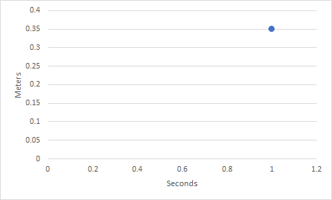

# Using Quantum Gates - The Circuit Composer

## How to Use the Circuit Composer

The circuit composer is a very intuitive tool - it's a great way to get started playing around with quantum circuits.

### Creating a new circuit

You start by selecting the new circuit button:

You'll then be taken into the tool itself.

On the left-hand side you can see a few different options. The first just displays some general information as above.

### Circuit Settings

The second lets you tweak your circuit, including the number of quantum registers \(each of which holds one or more qubits\) and the number of classical registers \(which is where results will be stored before they're processed and displayed\).

### The Circuit Editor

Next is a code editor that lets you directly work on the QASM code. This is the code the runs on the actual quantum computer - we won't discuss it much here because it's out of the scope of this guide.


[More information about QASM](https://www.quantum-inspire.com/kbase/qasm/)


### The Visualization Tool

Last is the visualization tab which shows you a graph that visualizes your state vector. The state vector shows the [_probability_](../physics/quantum-mechanics.md#probability) of finding the whole [_system in a particular state_](../qubits/quantum-bits.md#quantum-results) - it's the combination of all the qubits in your system. Since right now we have no circuit, it doesn't show much at all.

You can see that when I add a gate to the system, it splits up into all the different possible states, and shows the probability for each.

## Building a circuit

We'll use a simple example circuit as we continue along. 

As we mentioned before, you can see our two qubits on the left hand side of the circuit. Here they're labeled `q[0]` and `q[1]` . To begin, both qubits are in the $$|0\rangle$$ state. You can see that's labelled just to the right of the qubit labels.

After the labels, we have a straight horizontal line leading from each qubit. This isn't a [_wire like it would be in a classical system_](../quantum-circuits/classical-models-of-computation.md#the-circuit-model) - it's just a visual aid so that we can see which qubits are being acted on by which gates, in order.

Lastly, on the bottom, we have our classical registers. We have two of them, thus, `c2`. This is where we'll store our results.

### Adding Gates

To add gates to our system, we drag them from the pallet onto our circuit. Let's start by imposing our uniform superposition:

Now that we've used a Hadamard gate to each of our qubits, we can see that we have a since tidy superposition - this shows up on the left in our visualizer.


The visualizer can only show us what would happen _theoretically_ - for example, if we ran our circuit an infinite number of times. It's just an estimate.


### Measuring

Once we're done building up gates, we can measure our results. You can see that which qubit is being measured is labeled at the bottom of the circuit. First `q[0]` labelled `0`, then `q[1]` labelled `1`.

## Running the Circuit

When we've finished editing our circuit, we can save our work up at the top of the page.

### Saving your work

First, let's label our circuit:

Then we'll save it:

### Run conditions

Now we can run it:

IBM will give you a few different options to run your circuit. You can run it on a simulator, or on a real quantum computer. Since we're just testing, we'll run our work on the simulator on the default settings:

## Viewing the results

If we scroll down on the page, we can see the list of results we've gotten for this circuit. Since we've only run it once, we just have one. You can click on the particular run you'd like to see to get more information.

### The Results page

On the results page we're given a bunch of information about the work we just did. At the top we have the title of our run, the system that it was run on, the date it was run on, and some other details:

Below that we can see the circuit we put together vs. the circuit that actually run. In some cases gates may be converted in to an equivalent combination of other gates - that's where this may come in handy.

Lastly we have the results:

### Understanding the  results

#### Error

This is the same type of graph as our visualization gave us, except this time we can see that the probabilities are not perfectly even. In a perfect world we would expect the probability of each state to be 25%. There are a few reasons we don't see this.

The most obvious reason is that we [_don't have enough runs_](../qubits/quantum-bits.md#quantum-results), as in we didn't measure enough times. As we approach an infinite number of runs, we get closer to the theoretical probability. We can't do that here - we need to stop somewhere, preferably in a reasonable amount of time.

Another reason to consider is the accuracy of our quantum system. In the section about _classical bits_ we talked about _sources of error and noise_ in typical systems. Because quantum systems are so much more complex, we have more potential sources of noise, and therefore end up with more potential for error.

#### Interpretation

In this case, we're running a simple test - but what can you do with this information when you're actually attempting to do some kind of work?

This is where things can get very complicated. It depends on what you're attempting to do. If you're trying to compute some mathematical results, you're hoping to get a specific answer. If you're trying to scramble some data for encryption, you may be looking for a more even distribution.

In the end, this guide is intended to help you go from a very beginner to someone who can begin to understand more detailed literature, resources, guides and tutorials. I encourage you, if you'd like to use quantum computing to preform some specific task \(and not just understand how ti works on a surface level\), that you read through some of those more complete texts. They can help you understand how to better use the results you get.


You can find more details resources, guides and texts in the[ _resources section_](../getting-started/resources.md#understanding-quantum).


