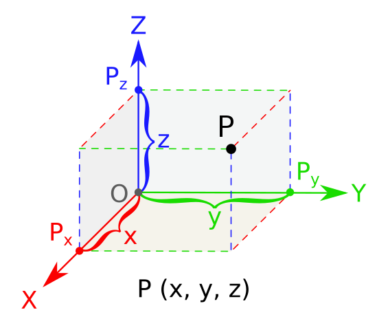

# Span, Basis and Spaces

## Space

If we imagine a three dimensional object, we might describe it as having three measurable quantities - width \($$x$$\), length \($$y$$\) and height \($$z$$\) [_\(Wikipedia - 2019\)_](why-linear-algebra/untitled-1.md#representation-of-3d-space):

We know intuitively that measuring the length at different heights along the object \(say in the middle and at the bottom\) gives us the same number. We can arbitrarily decide which length measurement is the one we use to describe the object on paper. It doesn't matter which we write down, because they provide the exact same information.

We can also see that only providing two measurements won't be enough... if we only give the length and the width, we're only describing part of the object. Someone reading our description will be missing critical information.


This is an important way to think about linear algebra - what information are we capturing? What information is irreducible?


So in order to describe a three dimensional object we need exactly 3 and only 3 measurements. Any more would be redundant \(it would simply copy already provided information\), and any less would be inadequate \(some critical information would be left out\).

### Generalization

If a vector is a measurement, then we need 3 [_vectors_](vectors.md#vectors) to describe our object - though we can see that there are practically limitless vectors that _exist_ along our object. If we don't want these vectors to be redundant, than we need something more than that - _3_ [_linearly independent_](linear-operations.md#linear-independence) _vectors_.

For the following sections we won't be describing any specific object, but rather abstract collections of vectors. These sets will include vectors that all have something in common, and which we can use to do more work. We call these sets **vector spaces**.

### Vector Entries & Magnitude

See also that these vectors must have the same number of entries as there are vectors required to describe the space they live in. This is because in order to define those vectors, we need to identify the measurements that make them up. Similarly to the description of the object being incomplete without the length, the length vector would be incomplete with out three magnitudes to identify it.

$$
|x\rangle=\begin{bmatrix}1\\0\\0\end{bmatrix}, |y\rangle=\begin{bmatrix}0\\1\\0\end{bmatrix}, |z\rangle=\begin{bmatrix}0\\0\\1\end{bmatrix}
$$

So here the $$|x\rangle$$ vector doesn't have any information in the $$y$$ or $$z$$ directions, but has one unit in the $$x$$ direction.

## Span

The span of a vector space is the set of all vectors that live in that space.

More specifically it's the smallest set of vectors that all fit in a particular space - so all independent vectors and all of the combinations of those vectors. This means you can have _redundant_ information:

$$
|u\rangle = \begin{bmatrix} 1 \\ 2 \end{bmatrix}   \& |v\rangle = \begin{bmatrix}2 \\ 4\end{bmatrix}
$$

But not _duplicate_ information:

$$
|a\rangle = \begin{bmatrix} 1 \\ 2\end{bmatrix} \& |b\rangle = \begin{bmatrix} 1 \\ 2\end{bmatrix}
$$


[More about linear sub-spaces and span](https://www.khanacademy.org/math/linear-algebra/vectors-and-spaces/subspace-basis/v/linear-subspaces)


## Basis

The basis of a vector space are those vectors the define the space itself. This is only the information required to describe the space.

This means that we cannot have _redundant_ or _duplicate_ information - all the vectors in the basis set must be linearly independent. You might describe this as the "minimum span".


An important quality of basis vectors is that they're perpendicular to each other. This is how we ensure they don't contain duplicate information - they're opposite each other.



[Detailed description of basis](https://www.khanacademy.org/math/linear-algebra/vectors-and-spaces/subspace-basis/v/linear-algebra-basis-of-a-subspace)


## Dimensions

A dimension is a generalization of a vector space. Any given space has $$N$$ dimensions if it has $$N$$ number of basis vectors. So a 2 dimensional space will have 2 basis vectors. 

