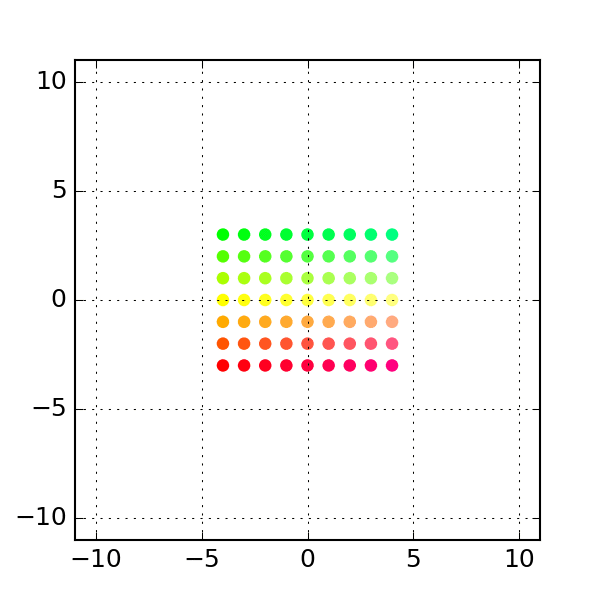
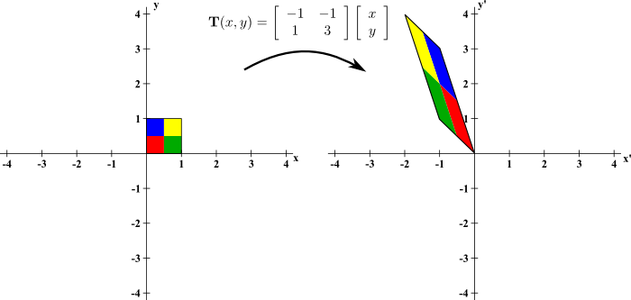

# Transformations

We can transform a vector to change it into another vector. In general, this vector can be in the same or in a different [_vector space_](space-dimension-and-span.md#space) - for example, a vector along one plane could transform into a vector along another plane [_\(Das, R \)_](linear-algebra-summary/math-references.md#animation-of-a-shear-matrix). 


[Fun transformation visualization tool](https://demonstrations.wolfram.com/MatrixTransformation/)



[More information about transformations](https://www.khanacademy.org/math/precalculus/x9e81a4f98389efdf:matrices/x9e81a4f98389efdf:matrices-as-transformations/v/transforming-position-vector)


## Notation

Transformations are labeled with a letter wearing a little hat - like this: $$\hat{T}$$. To apply the transformation, we [_multiply_ ](basics.md#matrix-multiplication)the vector by the transformation.

So, the expression...

$$
\hat{T}|x\rangle = |y\rangle
$$

...describes $$|y\rangle$$, which is a result of $$|x\rangle$$transformed by \(multiplied by the matrix represented by\) $$\hat{T}$$.

## Transformation Matrices

In general, we can use a matrix to define the actions preformed which result in a given transformation. We [_multiply_ ](basics.md#multiplication)a vector by the transformation to apply these operations in the proper order.

### Examples

#### The Identity Matrix

$$
Let \hspace{8pt} \hat{T}=\begin{bmatrix}1&0&0\\0&1&0\\0&0&1\end{bmatrix}, |u\rangle = \begin{bmatrix}3\\5\\7\end{bmatrix}
$$

$$
\hat{T}|u\rangle=\begin{bmatrix}1&0&0\\0&1&0\\0&0&1\end{bmatrix}*\begin{bmatrix}3\\5\\7\end{bmatrix}=\begin{bmatrix}3\\5\\7\end{bmatrix}
$$

If you preform the multiplication here you'll see that this transformation didn't do anything - we call this the identity transformation because it gives us the _identity_ of the matrix we transform it by. This special matrix will come in handy later. 

#### Rotational Matrix

$$
Let \hspace{8pt} \hat{R}=\begin{bmatrix}0&-1\\1&0\end{bmatrix}, |v\rangle = \begin{bmatrix}3\\5\end{bmatrix}
$$

$$
\hat{R}|v\rangle=\begin{bmatrix}0&-1\\1&0\end{bmatrix} * \begin{bmatrix}3\\5\end{bmatrix} =\begin{bmatrix}-5\\3\end{bmatrix}
$$

This transformation rotated $$|v\rangle$$ by $$90^\circ$$.


[Transformation matrix problems](https://www.khanacademy.org/math/algebra-home/alg-matrices/alg-matrices-as-transformations/e/multiplying_a_matrix_by_a_vector)


## Types of Transformations

### Transformations - Generally

In general, any matrix which can be _"applied"_ or _multiplied_ to another matrix can be a transformation. 

In the case of a column vector, we're affecting some kind of change on it, taking one thing and "making" it into another. The old vector and the new vector share a particular relationship, which is described by the transformation matrix.

### Linear Transformations

A linear transformation is a transformation that affects a vector within the context of vector spaces.

For example, we take a vector along one plane and transform it to a vector along another plane. Or perhaps we take a vector and rotate it within the same plane. We're talking about transformations within the context of linear relationships [_\(Nykam, D_ \)](linear-algebra-summary/math-references.md#2-d-linear-transformation-image).


[More specific details about linear transformations and how they work](https://www.khanacademy.org/math/linear-algebra/matrix-transformations/linear-transformations/v/linear-transformations)


### Operators

Operators are special linear transformations that transform a vector _within_ it's vector space.

In this case we can't change a vector in one plane into a vector in another plane, but we can rotate a vector along the same plane. This means all operators are linear transformations, but not vice versa.

