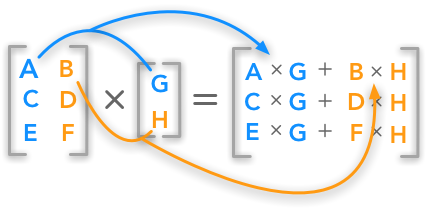

# Basics

## Matrices

A matrix is a way of organizing information. Just like a system of equations, we can use the information in a matrix to denote information about the system overall. The matrix will have dimensions m and n, where m is the number of rows and n is the number of columns.

$$
\begin{bmatrix}a&b&x\\d&e&f\\g&h&i\end{bmatrix}
$$

The individual values in the matrix are referred to as _elements_ or _components_.


[An introduction to matrices](https://www.khanacademy.org/math/algebra-home/alg-matrices/alg-intro-to-matrices/v/introduction-to-the-matrix)


## Vectors

You may be used to thinking of vectors as having a magnitude and a direction. This is a classical way of doing things - usually we're talking about vectors in a physical context, and therefore we're usually using them to describe where something is going [_\(Wikipedia - 2020\)_](../untitled-1.md#representation-of-a-vector).

Here we want to think of vectors in a more abstract way. Our vectors here are not really _going_ anywhere in particular. In the same way that we use matrices to hold some kind of information, we do the same with vectors.


**Note:** A vector contains multiple pieces of information, and a number holds exactly one. We call a plain old number a _scalar_, because it can be used to scale some other information \(like multiply it by 2 for example - changing the scale from 1 to 2\).


### Column Vectors

The vectors we're describing are the sort of column vectors you're likely already very familiar with.

$$
|x\rangle = \begin{bmatrix}
1 \\
2 \\
3 \\
\end{bmatrix}
$$

This kind of vector is just a one column matrix, and as such we can preform all of the matrix operations on it. 

A column vector has as many _elements_ as it does _dimensions_ - so for example a vector describing something in the real world would have _3-dimensions_ and therefore _3 elements_.


[Detailed Review of vectors](https://www.khanacademy.org/math/linear-algebra/vectors-and-spaces/vectors/v/vector-introduction-linear-algebra)


## Bra-Ket Notation

For quantum systems, we'll describe vectors using [Bra-Ket notation](https://en.wikipedia.org/wiki/Bra%E2%80%93ket_notation). Once you get the hang of it, it's simple enough, but for the uninitiated it might be a bit weird.

The basic idea is that vectors can be labeled with what looks like a line **\( \| \)** on one side and an angle bracket **\( &lt; , &gt; \)** on the other. 

So, for the vector _**x**,_ the label would look like this: $$ |x \rangle$$\_\_[_\(Griffiths, D. - p.119\)_](../untitled-1.md#bra-ket-notation) __. 

Actually, this is a "**ket**" vector. A "**bra**" vector looks like this: $$ \langle x| $$. You'll see later that we use this to our advantage when describing the inner product of two vectors: $$ \langle x|y \rangle$$, but that's another tutorial.

You can describe different things about a vector this way, too. So, for the vector _**x**_ over time _**t**_ we might write:

$$
|x (t) \rangle
$$

## Matrix Operations

For our purpose the only important kinds of matrix operations are addition and multiplication.

### Addition

Adding two matrices together requires that they both have the same number of rows and columns. As you might expect, you just add the respective entries together: 

$$ |x\rangle = \begin{bmatrix} 1 \\ 1 \\ \end{bmatrix}$$

$$ |y\rangle = \begin{bmatrix} 2 \\ 2 \\ \end{bmatrix}$$

$$ |x\rangle + |y\rangle = \begin{bmatrix} 3 \\ 3 \\ \end{bmatrix}$$

Simple enough. You should note that subtraction is just a sort of special case of addition, where you started by multiplying the second matrix by -1.


[Matrix addition and subtraction problems](https://www.khanacademy.org/math/precalculus/x9e81a4f98389efdf:matrices/x9e81a4f98389efdf:adding-and-subtracting-matrices/e/matrix_addition_and_subtraction)


### Product of Vectors

#### Dot product

The dot product of two vectors gives us a number representing the combination of the two. We denote this with the two vectors placed "back to back" - $$\langle x|y \rangle$$. For this operation, we multiply the corresponding entries and add all the results together, in order. 

So, for example:

$$
|x\rangle=\begin{bmatrix} 1 \\ 3 \\ \end{bmatrix} , |y\rangle=\begin{bmatrix} 2 \\ 4 \\ \end{bmatrix}
$$

$$
|u\rangle=\langle x |y\rangle
$$

$$
|u\rangle=(1*2) + (3*4) = 2+12=14
$$

Note that this only works with single column matrices.

#### Inner Product

The inner product is the more general form of the dot product. To be very broad, you can take the inner product of two vectors and end up with a _complex_ number instead of a _real_ number. We'll talk a bit more about inner product in the section on [_quantum mechanics_](../physics/quantum-mechanics.md#complex-numbers).

Some interesting properties of the inner product include the following \(assume that $$a\&b$$are scalars and $$|w\rangle, |u\rangle\&|v\rangle$$are vectors.

* It's linear:
  *  $$|au\rangle=a|u\rangle$$
  * $$\langle u | av \rangle = a \langle u|v \rangle$$
  * Where $$|u + w \rangle = |u\rangle + |w\rangle$$, $$\langle u | v + w\rangle = \langle u|v\rangle + \langle u | w \rangle$$
* The inner product of a vector with itself:
  * $$\langle u|u \rangle > 0 $$
  * Unless the vectors is 0 \(where all of the elements in the vector are 0\) - $$\langle v | v \rangle = 0$$

### Multiplication

There are two relevant types of multiplication: 

#### Scalar Multiplication

Where we multiply each entry in the matrix by a number:

$$ |x\rangle = \begin{bmatrix} 1 \\ 1 \\ \end{bmatrix}$$

$$ 2 * |x\rangle = \begin{bmatrix} 2 \\ 2 \\ \end{bmatrix}$$

As you would expect, you could also multiply the matrix by a variable.


[Scalar multiplication problems](https://www.khanacademy.org/math/precalculus/x9e81a4f98389efdf:matrices/x9e81a4f98389efdf:multiplying-matrices-by-scalars/e/scalar_matrix_multiplication)


#### Matrix Multiplication

Where we multiply two matrices together.

For this operation, we take the dot product of the columns in the first matrix with the rows of the second matrix. This might be a difficult definition to understand, so let's lay out the rules one by one:

* Multiplication goes **row** by **column**
* Multiply the first entry of the first column of the first matrix by the first entry in the first row of the second matrix
* Add this to the result of the next entries, respectively
* Continue until there are no more entries

As you can see, this means that the **number of entries in the rows** of the first matrix have to be equal to the **number of entries in the columns** of the second matrix.

Here I'll include a lovely graphic that should clear things up significantly [_\(Jean, H. - 2018\)_](../untitled-1.md#matrix-multiplication-image):

There, much better. You should be able to see that you'll end up with a single column matrix at the end.


[Matrix multiplication problems](https://www.khanacademy.org/math/precalculus/x9e81a4f98389efdf:matrices/x9e81a4f98389efdf:multiplying-matrices-by-matrices/e/multiplying_a_matrix_by_a_matrix)


