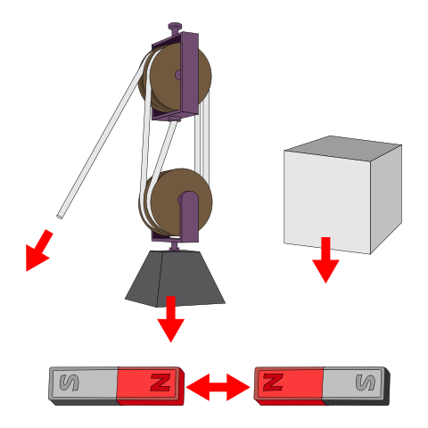
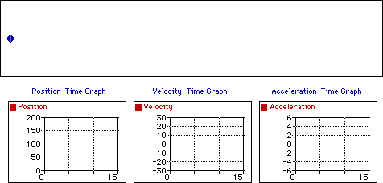

# Classical Mechanics

In physics we use mathematical models to describe the world around us. Classical mechanics includes models for medium sized stuff.

## Measuring Physical Systems

### Mass

Each object contains a certain amount of matter - what we could call it's _mass_. This is a more fundamental property than it's weight, which depends on how much gravity is a applied to it.

Intuitively you can understand that a desk takes more effort to move then a pen. By knowing how _massive_ an object is, we can calculate how much energy it will take to make some change to the position of that object.


[More on the difference between weight and mass](https://www.khanacademy.org/science/physics/forces-newtons-laws/normal-contact-force/a/what-is-weight)


### Position

Let's start with a static mass \(an object in this case - let's imagine a ball\) at a given position. We know _exactly_ where this object is, because we can go ahead and check it directly.

When measuring the position of our object, we decide where to "origin" is - where our 0 will be.

### Time

Everything occurs over a finite amount of time. Similarly to the position, we measure time from some origin which we decide on. Everything that happens, happens _after_ some arbitrary point in the past that we designate as time 0.

As forces act on our object, it's position changes over time. If we kick the ball, we might construct a graph of it's movement that looks like this:

First the ball goes up, and after a while it comes down.


[More information about position vs. time graphs and how they're used](https://www.khanacademy.org/science/physics/one-dimensional-motion/displacement-velocity-time/a/position-vs-time-graphs)


### Force

Nobody is going anywhere unless we can affect some change on the system. _Forces_ are how we do that - they offer some quantifiable change to the _state_ of a given object.

#### State

The state of a system, or an object, is the collection of all the information we know about it at a particular point in time. Say, for example, right at this instant.

We might say that the state of our cat is _at rest_ - he's sleeping, and going nowhere. The state of a system can be more complex - because systems are collections of multiple objects, there might be a lot of information that describes it's current state. The cat cafe system may also be at rest - all of the cats are sleeping, and nobody is moving.

#### Types of Forces

There are a bunch of different types of forces - magnetic, nuclear, gravity... we won't discuss specific forces and how to calculate them. What's important for this tutorial is that you understand the concept [_\(Wikipedia - 2020\)_](physics-summary/physics-references.md#representation-of-forces-image). 


[An introduction to Newton's First Law](https://www.khanacademy.org/science/physics/forces-newtons-laws/newtons-laws-of-motion/a/what-is-newtons-first-law)


## Notation

An object in 3-D space can be described using a [_vector_](../linear-algebra/basics.md#vectors), like we talked about in our discussion of [_space_](../linear-algebra/space-dimension-and-span.md#space).

Matrices are just a way for us to store and manipulate information, and so we store the important information about our object in a column matrix. At any given moment in time, the relevant information about our object is it's position, and so our vector is a position vector.

So the vector $$|x\rangle$$ represents the position of our object, called $$x$$.

### Position and Time Together

Let's add some information to our position vector. The vector is _changing_. Changing how? Changing with respect to the _time._ How do we describe the change in position of object $$x$$ over some amount of \(with _respect_ to\) time $$t$$?

$$
|x(t)\rangle
$$

## Newton's Second Law

So far we have two distinct ideas:

#### State of the System

As we mentioned when talking about [_force_](classical-mechanics.md#force), the state of the system is all the information we have about what's going on _right now_ \(so at time $$t$$\).

#### Change in the System

Forces in the system affect some _change._ Things that are still can be made to move, things that are moving can be made to stop, directions can be changed... all with the application of a suitable amount of energy __[_\(Physics Classroom - 2020\)_](physics-summary/physics-references.md#animation-showing-an-object-in-motion-and-the-graphs-that-describe-its-motion).

### The Relationship Between State and Change

Newton's second law preforms a useful service for us in that it connects these two ideas. It explains _how_ a force changes the state of an object or a system.

#### Equations of motion

You may have seen this thing during high school physics, or even earlier than that depending on how enthusiastic your grade school science teacher was. Either way, it's a diagram of the general way of describing Newton's second law:

$$
\overrightarrow{F}=m\overrightarrow{a}
$$

The sum of the forces in the system is equal to the mass multiplied by the acceleration \(how fast the mass is increasing the speed of it's movement\). Here the acceleration and force are also _vectors_ \(they both contain multiple pieces of information\), where the mass is just a _scalar_ \(a number\):

$$
|F\rangle=m|a\rangle
$$

Let's consider the cat system: let's say the cat weighs 2 kilograms. No force is applied to him \(he's asleep right now\). How fast is he accelerating?

$$
|F\rangle=m|a\rangle \rightarrow |a\rangle= \frac{|F\rangle}{m}
$$

$$
|F\rangle= 0 , \hspace{6pt} m =2, \hspace{6pt} \overrightarrow{a}=?
$$

$$
|a\rangle = \frac{0}{2}=0
$$

Clearly not at all... he's going nowhere slowly.


[A detailed summary of Newton's Second Law](https://www.khanacademy.org/science/ap-physics-1/ap-forces-newtons-laws/newtons-second-law-ap/v/newton-s-second-law-of-motion)



[Problems for Newton's Second Law](https://www.khanacademy.org/science/ap-physics-1/ap-forces-newtons-laws/newtons-second-law-ap/e/newton-s-second-law)


## How to Know Everything

Let's look carefully at this equation... what _irreducible_ information exists about a physical system?

* The mass of all the objects in the system
* The position of those objects

If we have these two pieces of information for a particular point in time, then we can figure out anything else we might want to know \(like the force\) for that same moment in time.

Therefore, if we wanted to know everything about the system, then we would need to know the mass and position at _every possible time_ $$t$$ [_\(Griffiths, D - p.1\)_](physics-summary/physics-references.md#the-whole-problem-in-classical-mechanics). This is what classical problems all reduce down to - where are we, what's happening, when:

$$
\text{Given} \hspace{8pt} |x(0)\rangle, \hspace{6pt} |v(0), \hspace{6pt}|F(t)\rangle
$$

If you know the position of $$x$$ when time $$t=0$$, and the _velocity_ \(or speed\) when $$t=0$$, and the force for all possible values of $$t$$...

$$
\text{Find} \hspace{8pt} |x(t)\rangle \hspace{8pt} \text{For all}\hspace{6pt} t
$$

...find the position of $$x$$ for all possible values of $$t$$...

$$
\text{Where} \hspace{8pt} m*\frac{d^2 * |x(t)\rangle}{dt^2} = |F(t)\rangle
$$

...where Newton's second law \(here described with calculus\) is the relationship between all of those things.

