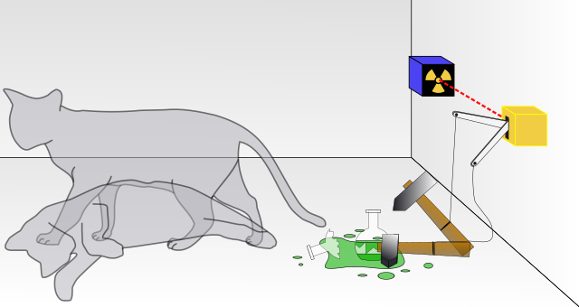

# Quantum Mechanics

If you've read this document so far in one sitting, I'll commend you for that. I hope you've felt like it was informative. However... if you haven't yet, this is the moment to take a break. Have some tea, and make sure you've been able to follow along so far. Things are about to get _weird_.

Whereas classical mechanics tells us about medium size stuff \(so just about 100% of the things we interact with\), quantum mechanics deals with the tiniest stuff. The models used are much more complex, because stuff that small is very unpredictable.

You couldn't describe medium sized stuff with the same rules that you describe quantum sized stuff, simply because they don't behave in the same ways. The opposite is also true - the models used for medium sized stuff just aren't detailed enough to use on super small stuff.

## Measuring Quantum Systems

### N-Dimensional Space

Previously, we were talking about a mass \(an object\) in a 3-dimensional space. 

When we talk about quantum systems, we're instead talking about a _particle_ \(an object with very little mass\) in an $$n$$-dimensional space. That is to say, in a space without a defined number of dimensions. Which is to say, described by [_vectors_ ](../linear-algebra/vectors.md#vectors)with an undefined number of [_elements_](../linear-algebra/vectors.md#column-vectors).

Later on, we'll discuss those $$n$$-dimensions, what they represent, and how to calculate a value for $$n$$.


It isn't helpful to attempt to think of this $$n$$-dimensional space  as some kind of physical location. Matrices and vectors provide information - here, we're representing different information then we are in classical mechanics.


### Complex Numbers

Another thing that's different is the numbers we can use to describe quantum systems. Where before just the regular _real_ numbers were enough, now we'll also include _imaginary_ numbers. This is how we can model such complicated interactions.

#### Imaginary numbers

We use the imaginary number $$i$$ to describe questions we don't have an answer to. Like this:

$$
\sqrt{2} = i \hspace{8pt}\text{or}\hspace{8pt}i^2=-1
$$

$$i$$ is used to describe some imaginary unit, where we don't know the quantity. We extend the real numbers as we know them to include information we don't have a clear description for. We allow ourselves to include this in our calculations so we can describe things beyond our normal understanding.


[An introduction to imaginary numbers](https://www.khanacademy.org/math/algebra2/x2ec2f6f830c9fb89:complex/x2ec2f6f830c9fb89:imaginary/v/introduction-to-i-and-imaginary-numbers)


#### Combinations including imaginary numbers

So if we take some multiple $$b$$ of the imaginary quantity $$i$$ and we combine it with some real quantity $$a$$, we get something like this:

$$
z = a+bi
$$

Where $$z$$ is the result. Even if we gave some values to $$a$$ and $$b$$...

$$
\text{Let}\hspace{6pt} a=4, \hspace{6pt} b=2
$$

$$
z = 4 + 2i
$$

...we wouldn't be able to calculate the value of $$z$$, because we can't separate $$2$$ and $$i$$. We have no idea what $$i$$ is, and so we have no idea what $$2i$$ is. This leaves us with two parts of $$z$$ - the real quantity $$4$$ and the imaginary quantity $$2i$$.

#### Complex numbers

So $$z$$ is a complex number - a combination of a real and imaginary quantity that we can't fully calculate. Some information exists, but we're not able to extract it.


[An explanation of complex numbers](https://www.khanacademy.org/math/algebra2/x2ec2f6f830c9fb89:complex/x2ec2f6f830c9fb89:complex-num/v/complex-number-intro)


### Quantum Vectors

So quantum vectors are:

* Column vectors
* Describe quantum particles
* Have $$n$$ number of elements
* Include elements that are complex numbers

#### Notation

We denote quantum vectors with the Greek letter "psi", which looks like this: $$\psi$$. Just like all our other vectors, we'll use [bra-ket notation](../linear-algebra/vectors.md#bra-ket-notation) to indicate that it's a vector:

$$
| \psi \rangle
$$

As before, we're interested in the state of out vector over time, so we can indicate that we're talking about it for _all possible values_ for the time variable $$t$$ like this:

$$
|\psi(t)\rangle
$$

Or we could specify a particular time, say $$t=3$$ like this:

$$
|\psi (3)\rangle
$$

An important thing to note about quantum vectors is that they have to be _normalized_ - this has to do with quantum operations needing to be reversible. This means the [_inner product_](../linear-algebra/vectors.md#inner-product) __of the vector with itself must be 1:

$$
\langle \psi (t)\hspace{3pt}|\hspace{3pt}\psi (t)\rangle = 1
$$


[More information about quantum vectors](http://physics.mq.edu.au/~jcresser/Phys301/Chapters/Chapter8.pdf)


## Quantum State

Earlier, we can talked about [_state_ ](classical-mechanics.md#state)in a very simple way.

In the [cat system](classical-mechanics.md#state), we have a single object \(the cat himself\), and only a few important quantities. Is he moving? How fast? And when? The state of the cat system at any given point in time is defined \(and distinguished from the state at any other given time\) by the information be know about it. The system is at rest - the cat isn't moving.

The state of a quantum system is basically the same - it is defined by the information we know about the system at that given point in time.

The key difference is that instead of deciding what measurements we want based on the state of the system \(classical\), the measurement we get depends on the state of the system \(quantum\). We _don't know_ the exact state of the system ahead of time because we _can't know_ until we measure it.

We can't know because the quantum system can exist in multiple states _at the same time_. It's only after we look at it \(observe it, measure it\) that is _collapses_ into one and only one state. The state at a given time is a probability distribution across all of the _possible_ states. Before we measure, we can only say what we're likely to see - not what we'll certainly see [_\(Maalouf, A - 2016\)_](../physics-references.md#the-difference-between-quantum-and-classical-state).

### Distinguishable States

Quantum state and classical state are essentially the same. The difference is in how we measure them. We're always looking for _information_ about the system. What do we know about this particle at this moment in time? How is that different from any other point in time?

Information is only useful if we can tell it apart from other information. If it's too similar to something else, it may as well be duplicate information. Therefore we group quantum states based on whether they're _distinguishable_ - whether or not we can tell them apart from some other state.

Each of the $$n$$-dimensions of a quantum vector represents a distinguishable state of the system overall. 

### Superposition

There he is - our boy. Certainly if you've heard about quantum physics at all, you've heard about this cat. This thought experiment does a great job of helping us understand the idea of superposition of quantum states [_\(Wikipedia - 2020\)_](../physics-references.md#a-graphic-depicting-the-schrodinger-cat-thought-experiment).

The idea is very simple - a quantum system may be in multiple states at once. These states are _superimposed_ on top of one another - they're impossible to tell apart until we measure them. However, like we said earlier, as soon as it's measured, the state can exist in one and only one state. Therefore by looking at it, we change it. The state _collapses_ into one of the possible options.

With the cat here, we've set up a situation where this cat will certainly die... at some undetermined point \(not very vegan of us, is it?\). We don't know whats going on in there because we can't see... until we open the box! But when we open the box the cat will either be alive or dead. We'll know exactly what was going on in there... because we're looking at it. We lost our superposition of states - the system has collapsed in order to give us an answer.

This idea can be extended to include systems with a whole bunch of possible states - $$n$$ distinguishable states in fact. The system can be in all of them at the same time - the system can contain all the _information_ for all of them at the same time. Until the moment we measure it.

### Probability

Before the exact state is measured, we talk about the system in terms of probabilities. Given $$n$$ possible distinguishable states, how likely are we to get a specific state when we take our measurement?

For our cat in the box there are $$2$$ distinguishable states - dead and alive. At any given moment it is just as likely that we'll have one or the other - the probability of getting either is 50%.

This is a special case for our system - we have a _uniform superposition_, where are states are equally likely to exist [_\(Griffiths, D - p.5\)_](../physics-references.md#statistical-interpretations-in-quantum-mechanics).

### The Wave Function

The wave function is the ultimate understanding of a quantum system. All of the information contained in the system is expressed in the wave function [_\(Wikipedia - 2020\)_](../physics-references.md#an-animiation-showing-diffeent-harmonic-oscillators)_._

For our purpose a detailed understanding of the quantum wave function isn't. As with the wave function, specific information about the Hamiltonian isn't so important. You only need to know that it exists and that it's used to get relevant information out of the wave function required. You only need to understand that it exists, and that it contains way too much information for us to measure it. Just like superimposed states contain too much noise too understand while they're overlapping, the wave function can't be understood as a whole - only in parts.


[An explanation of what the wave function is](https://www.khanacademy.org/science/physics/quantum-physics/atoms-and-electrons/v/quantum-wavefunction)


## Hamiltonian

How do we extract the relevant portions of the wave function? 

A Hamiltonian is some function \(some math\) that we develop in order to get some useful information out of the quantum wave function. Passing it through this operator destroys some of the information - but in doing so removes the barrier preventing us from doing some useful work with it.

## Schrodinger's Equation

In classical mechanics, the relationship between the two separate types of information \(information about _state_ and information about _change_\) is defined with [Newton's second law](classical-mechanics.md#newtons-second-law).

Schrodinger's equation does exactly that, but instead for quantum systems. It tells us the relationship between the state, the wave function and a particular Hamiltonian. Excited to see it [_\(Griffiths, D - p.1\)_](../physics-references.md#the-schrodinger-equation)?

$$
\hat{H}(t)*|\psi(t)\rangle = i\hbar*\frac{\partial |\psi(t)\rangle}{\partial t}
$$

Wow... look at all those... letters? In this equation...

* $$\hat{H}$$ is a [_Hamiltonian_](quantum-mechanics.md#hamiltonian)\_\_
  * Like in the classical system $$(t)$$ tells us we're measuring this quantity for all possible values for time $$t$$
* $$|\psi\rangle$$ is our [_quantum vector_](quantum-mechanics.md#quantum-vectors), denoted by the Greek letter psi
  * Again ranged over all values for $$t$$ , so $$|\psi (t)\rangle$$
* $$i$$ is our [_imaginary number_](quantum-mechanics.md#imaginary-numbers)\_\_
* $$\hbar$$ is Planck's constant 
  * Describes the "quantum electromagnetic action" - a relationship between the energy in a photon and the frequency of that photon
* $$\frac{\partial}{\partial t}$$ is the partial derivative with respect to $$t$$

### Solving the Equation

You may say to me - author lady, this makes no sense. This equation includes a bunch of quantities that we can't know:

* We don't know what $$i$$ is
* We're not sure what $$|\psi\rangle$$ is doing for all values of $$t$$
* Something something wave function, something something information???

This isn't a solvable math problem - I can't tell you the answer to this!

I have good news and bad news for you:

#### Good news: You're right!

#### Bad news: You're right....

We can't solve this problem. This is the _whole_ problem in quantum mechanics. We can solve some of it, but never all of it.

