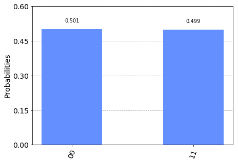

# Parts of a Qiskit Program

## Classical Registers

On a classical system, a register is a storage unit which holds multiple bits. Registers are not used to preform any instructions or math, though instructions may be stored on them. We use classical registers in our quantum program to hold the result when we measure out qubit.

You create a new classical register in qiskit like this:

```python
cr = ClassicalRegister(2)
```

This piece of code creates a classical register holding two bits, and stores it in the variable `cr`.

## Quantum Registers

Quantum registers are like classical ones, except they hold qubits instead of bits. They can hold multiple qubits at a time, and we can operate on each qubit separately.

You create a new quantum register in qiskit like this:

```python
qr = QuantumRegister(2)
```

This creates a quantum register holding two qubits, and stores it in the variable `qr`.

## Circuits

As previously mentioned, we want to operate on our system using quantum gates. This means we need to create a new quantum circuit. It will behave similarly to the circuit in the[ _circuit composer_](../ibmq/using-quantum-gates-the-circuit-composer.md), but we'll write code to add gates and operations instead of dragging and dropping them.

Just like in the circuit composer, we need to get set up with the number of qubits we want as well as enough classical registers to store the information we measure. You need to have **at least as many classical bits as you have qubits** so that you can store the state of all of them. You can have more if you like, just not less.

We create out circuit like this:

```python
circuit = QuantumCircuit(qr, cr)
```

This circuit include the two qubit quantum registers and the two bit classical register created above.

### Applying Gates

We apply gates to our circuit object by applying the appropriate methods to it. So we apply the [Hadamard gate](../quantum-circuits/single-qubit-gates.md#hadamard-gate) to the first qubit in the system like this:

```python
circuit.h(qr[0])
```

In circuit `circuit`, apply the Hadamard gate `h` to qubit `q[0]` in quantum register `qr`.

For a gate which operates on more than one qubit, we pass in both. Often order will be important:

```python
circuit.cx(qr[0], qr[1])
```

In circuit `circuit`, apply the controlled not gate `cx` to qubits `qr[0], qr[1]` in quantum register `qr`, where `qr[0]` is the control qubit and `qr[1]` is the target qubit.


[More information about the _circuit_ object and the gate methods you can apply to it](https://qiskit.org/documentation/stubs/qiskit.circuit.QuantumCircuit.html#qiskit.circuit.QuantumCircuit)


## Measurements

We can measure our circuit like this:

```python
circuit.measure(qr, cr)
```

You can see that we start with our quantum register and finish with the classical register that will store the result. We can also choose to measure only one qubit into only one register:

```python
circuit.measure(qr[1], cr[1])
```

Measure qubit `q[1]` in quantum register `qr` , and store the result in bit `cr[1]` in classical register `cr`, from circuit `circuit`.

## The Back-end

### Simulators

Once you're ready to run your qiskit code, you can load a simulator on your local machine to test it. The simulator will give you an idea of whether your circuit is behaving as expected. You can spin up a simulator like this:

```python
simulator = Aer.get_backend('qasm_simulator')
```

Qiskit has a few different components \(which we'll discuss a bit later\) and a few different simulators you can use. Aer is the component that has the different simulators, and the QASM option simulates the quantum assembly language used on IBM systems. Here we've labeled our simulator `simulator`.

### IBM Quantum Systems

If you've tested your circuit and think the result turned out well, then you can go ahead and run it on an actual quantum computer. This requires a few simple steps.


The information in this guide is up to date at the time of writing, but it never hurts to check the [official IBM documentation](https://qiskit.org/documentation/apidoc/ibmq-provider.html) in case something changes \(it's very well maintained\).


After your account is connected and loaded \(we'll see an example of this in the next section\), you can specify a provider, a system and create a job. After that you can submit and run your job.

```python
provider = IBMQ.get_provider('ibm-q')
qcomp = provider.get_backend('ibmq_16_melbourne')
job = execute(circuit, backend=qcomp)

job.monitor(job)
```

* Our provider is where back-ends are supplied from - in this case IBMQ. 
* We choose a back-end from the options available from our provider - IBM has a number or systems \(which are named for different cities, not necessarily where they are housed\) and we can choose whichever one we like. 
* We set up or job, which is the circuit we want to run along with the system we want it to run on. 
* We can submit and monitor our jobs progress using `job.monitor`. This lets us know where our job is in the queue and when it's finished.


IBM systems are public, and as such multiple jobs may be ready at the same time. When you submit your job it automatically gets put in line and is run when it's turn comes up.


## Visualizations

Qiskit has a number of options for viewing your results and looking at your circuits. Something to keep in mind is that you'll need to build some kind of interface for most of these visualizations to appear, or you'll need to run your code in something like a [_jupyter notebook_](../getting-started/resources.md#jupyter) that provides an interface for you. 

For a plain text output of your circuit, you can use:

```python
circuit.draw()
```

For our simple two qubit system, you might see something like this:

```text
q0_0: |0>
q0_1: |0>  
c0_0: 0 
c0_1: 0 
```

If you have matplotlib installed, you can specify that as the output method:

```python
circuit.draw(output='mpl')
```

That will result in something like this:


You can see that it looks very similar to the circuit composer, which is handy. You can have your results printed out in a nice graph \(also similar to output in the circuit composer\):

```python
plot_histogram(result.get_counts(circuit))
```



