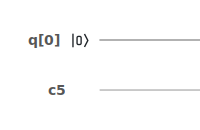
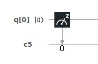

# Quantum Information

In this section, we'll combine many of the concepts we've discussion in the tutorial so far. This means that if anything so far has confused you or if you feel like you need more information on anything, this would be the time to review.

## Reversible Computing

Simply put, quantum calculations need to be reversible. During the process of quantum computation, _information_ should not be destroyed. 

In a classical system this isn't a concern - as long as we get the result we're looking for, we don't have any problem. For our [_Turing machine_](classical-models-of-computation.md#the-turing-machine), the state of the system changes with every instruction. We're not so concerned with remembering the _previous_ state, as long as the _current_ state conforms to our expectations.

### Reversibility

> A computation is _reversible_ if it is always possible to uniquely recover the input, given the output. For example, the NOT operation is reversible, because if the output bit is 0, you know the input bit must have been 1, and vice versa. On the other hand, the AND operation is not reversible. [_\(Kaye, P. - p.12\)_](quantum-circuit-summary/quantum-circuit-references.md#reversibility)\_\_

It's important to fully understand what this means. If I provide to you only the resulting state of some quantum computation, it must be true that you can figure out where I started from. 

### Converting Classical Gates

While most classical gates are not reversible, we can change them so that they are. This requires adding more wires, used only to keep the information we put in [_\(Kaye, P. - p.12\)_](quantum-circuit-summary/quantum-circuit-references.md#diagram-of-the-reversible-and-gate)_:_

### Measuring

The one non-reversible action we take in quantum computation is [_measuring_ ](../physics/quantum-mechanics.md#measuring-quantum-systems)\(or observation\).

When we measure a qubit, it [_collapses_ ](../qubits/quantum-bits.md#measuring-qubits)into a particular state. It's forced to reveal what it had been doing this whole time - like our [_cat in the box_](../physics/quantum-mechanics.md#superposition), we know if it was alive or not.

This means we need to measure at the end whenever possible, so that we preserve reversibility until we have no choice.


[More detail on what measurement is and how it works](https://towardsdatascience.com/understanding-basics-of-measurements-in-quantum-computation-4c885879eba0)


## The Bloch Sphere

The Bloch sphere can be used to describe the behaviour of single qubit systems [_\(Wikipedia - 2020\)_](quantum-circuit-summary/quantum-circuit-references.md#diagram-of-the-bloch-sphere). Here we see that we have a [_3-dimensional space_](../linear-algebra/space-dimension-and-span.md#space), and like all quantum system we're able to[ _range across the complex numbers_ ](../physics/quantum-mechanics.md#quantum-vectors)as well as the real numbers.


[More general information about the Bloch sphere](https://www.quantiki.org/wiki/bloch-sphere)


### What the Diagram Shows Us

Let's explore some of the things labelled on this diagram:

* $$x, y , z$$ are our three axis for 3-dimentional space
  * Note that the sphere has a radius of exactly _one unit_ 
* $$|0\rangle$$ and $$|1\rangle$$ are our two distinguishable states
  * See that these two are opposite each other on the diagram
* $$|\psi\rangle$$ is our vector in an unknown state - the single qubit we're describing
  * Our qubit projects a _shadow_ - this is the dotted line we see
  * When we draw a line between the shadow and our vector, we get a right angle triangle
* $$\theta$$ is the angle between the vector for our qubit $$|\psi\rangle$$ and the $$z$$ axis
* $$\varphi$$ is the angle between the shadow of our qubit and the $$x$$ axis

The sphere shows us all of the possible states our single qubit can be in. Not just $$|0\rangle$$and $$|1\rangle$$, but the infinite combinations in between. By measuring the angle the vector $$|\psi\rangle$$ and it's shadow make with respect to the $$x$$, $$y$$and $$z$$ axis, we can derive the probability of finding our qubit in a particular state when we measure it.

This diagram doesn't show multiple qubits systems, mostly because it _can't_. Systems with more than one qubit are too complex to imagine with a picture like this.


[More detailed information about how the Bloch sphere is derived and what information we can find on it](https://physics.stackexchange.com/questions/204090/understanding-the-bloch-sphere)


## Quantum Circuits

Using these principles of quantum information, we can begin to construct quantum circuits in the same way that we would with a classical circuit.

### Quantum Gates

Like [_classical gates_](classical-models-of-computation.md#using-gates), quantum gates are all described with a [_transformation matrix_](../linear-algebra/transformations.md#transformation-matrices) which tells us how they change our qubit vector.

However, there are a few important differences between classical gates and quantum gates. One is that all these operators will be _reversible._ This means our transformation matrices will have an _inverse_ that we put our output in to get back to our input.

Another is that we can now include [_imaginary_](../physics/quantum-mechanics.md#imaginary-numbers) and [_complex_](../physics/quantum-mechanics.md#complex-numbers) numbers in our transformations. This accounts for quantum vectors ranging over the set of complex numbers in addition to real ones.

Lastly quantum gates produce the _same number of outputs as we provide inputs_. This means no quantum gates are like the classical AND gate, where they two in two inputs and produce one output. This relates back to [_reversibility_](quantum-information.md#reversibility) - no information can be lost.

### Notation

#### The circuit

We draw quantum circuits in a similar way that we draw classical gates. We start with our inputs on one side, put them through various transformations via logic gate, and on the other side we get our outputs. 

Though the quantum circuit doesn't have a _wire_ like the classical one, we'll still use a line to show which inputs are entering which gates and in what order.

Most gates will be represented by a box around their corresponding symbol - some may be represented by other symbols. As we go through descriptions for the different gates, we'll include their symbols [_\(Kuo, S. - 2013\)_](quantum-circuit-summary/quantum-circuit-references.md#diagram-showing-the-representation-of-several-quantum-circuits):

#### Measurements

Though the process of measurement doesn't have a transformation matrix and isn't really a gate, we'll use a similar notation for it:

Recall that measurements are stored in classical bits, so our diagram will also include those:


For these tutorials, gates will be produce using IBMQ's [_Circuit Composer_](https://quantum-computing.ibm.com/composer) tool. We'll talk more about how you can get access to this later on.


