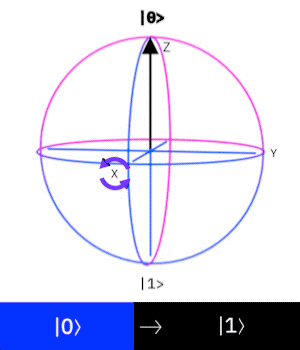
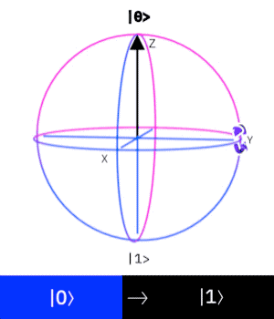
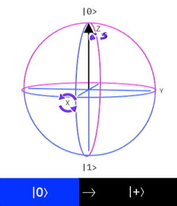
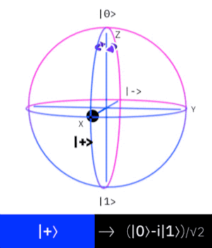

# Single Qubit Gates

Over the course of this tutorial, we won't be able to go through all possible quantum gates. We will however take time to go through the most important ones, especially ones that we'll use when learning to code later on.

## The Identity Gate

A very simple gate, which doesn't change anything at all. It preserves the state of the system as it is - it gives us the identity of the qubit.

$$
I=\begin{bmatrix}1&0\\0&1\end{bmatrix}
$$

## Pauli Gates

These gates work by changing the direction of the vector $$|\psi\rangle$$ in either the $$x$$, $$y$$ or $$z$$ direction.


[More about the Pauli matrices and where they come from](https://en.wikiversity.org/wiki/Pauli_matrices)


### Pauli X

The Pauli X gate is exactly the classical NOT gate as we described earlier:

$$
X = \begin{bmatrix}0&1\\1&0\end{bmatrix}
$$

$$
|0\rangle \rightarrow |1\rangle, |1\rangle \rightarrow|0\rangle
$$

And here is how the X gate will be represented on our circuit diagram:

We can track the result on the Bloch sphere:

### Pauli Y

The Pauli Y gate is an interesting machine - we get the same result as the Pauli X gate, but instead of moving through real space we move through imaginary space instead.

$$
Y=\begin{bmatrix}0&-i\\i&0\end{bmatrix}
$$

### Pauli Z

The Pauli Z gate changes the state of our qubit along the plane formed by the vectors represented by our two states. This means that no change will occur if we're fully in one state or the other - only if we're somewhere between the two.

$$
Z=\begin{bmatrix}1&0\\0&-1\end{bmatrix}
$$

## Hadamard Gate

The Hadamard gate imposes the _uniform superposition_ on our system. This gate is very important, because often we need to scramble our initial state before we can start computation. The Hadamard gate does this for us in a predictable way.

$$
H=\frac{1}{\sqrt{2}}\begin{bmatrix}1&1\\1&-1\end{bmatrix}
$$

## Phase Gate

The Phase gate is often referred to as the "Z90" gate or the "S" gate. We can see that it's half of our Z gate - instead of going half way around the Bloch sphere, we only go a quarter \(a 90 degree turn\).

$$
S=\begin{bmatrix}1&0\\0&i\end{bmatrix}
$$

## The T Gate

The T gate preforms a $$\frac{1}{8}$$ turn on the sphere. It's a quarter of our Z gate, and half of our S gate. You might think that there's a relationship between the T gate and the S gate, and you'd be right - one S gate ammounts two the T gate squared: $$S=T^2$$

$$
T=\begin{bmatrix}1&0\\0&exp(\frac{i\pi}{4})\end{bmatrix}
$$


This $$exp(a)$$ notation just means to take the constant $$e$$to the power of whatever is in the brackets - i.e. $$e^a$$. You'll see this notation used often, so I've left it unconverted here for you.


## Reversibility

We said before that all of our quantum gates need to be [_reversible_](quantum-information.md#reversibility). For most of these gates \(in fact all of them except the _phase gate_ and _T gate_\) they reverse themselves.

That is to say that if you apply the _Pauli X_ gate twice, for example, it undoes what it did. This makes intuitive sense when we look at the diagram. If we make a 180 degree turn the first time, we would make the same turn when we go the second time, resulting in ending up where we started.

### Reverse Phase Gate

The _phase gate_ requires an extra step - we need to do some math to it to find the matrix that reverses it's operations. We denote reverse matrices using the $$\dagger$$ symbol, so this would be the $$S^\dagger$$ gate.

$$
S^\dagger = \begin{bmatrix}1&0\\0&-i\end{bmatrix}
$$

