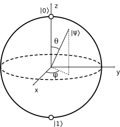

# Single Qubit Gates

## Pauli Gates

Let's revisit our Bloch sphere [_\(Wikipedia - 2020\)_](quantum-circuit-summary/quantum-circuit-references.md#diagram-of-the-bloch-sphere):

These gates work by changing the direction of the vector $$|\psi\rangle$$ in either the $$x$$, $$y$$ or $$z$$ direction.


[More about the Pauli matrices and where they come from](https://en.wikiversity.org/wiki/Pauli_matrices)


### Pauli X

The Pauli X gate is exactly the classical NOT gate as we described earlier:

$$
X = \begin{bmatrix}0&1\\1&0\end{bmatrix}
$$

$$
|0\rangle \rightarrow |1\rangle, |1\rangle \rightarrow|0\rangle
$$

And here is the X gate represented on our circuit diagram:

We can track the result on the Bloch sphere:

