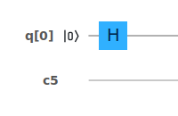

# Single Qubit Gates

Over the course of this tutorial, we won't be able to go through all of possible quantum gates. We will however take time to go through the most important ones, especially ones that we'll use when learning to code later on.

## Pauli Gates

These gates work by changing the direction of the vector $$|\psi\rangle$$ in either the $$x$$, $$y$$ or $$z$$ direction.


[More about the Pauli matrices and where they come from](https://en.wikiversity.org/wiki/Pauli_matrices)


### Pauli X

The Pauli X gate is exactly the classical NOT gate as we described earlier:

$$
X = \begin{bmatrix}0&1\\1&0\end{bmatrix}
$$

$$
|0\rangle \rightarrow |1\rangle, |1\rangle \rightarrow|0\rangle
$$

And here is the X gate represented on our circuit diagram:

We can track the result on the Bloch sphere:

### Pauli Y

$$
Y=\begin{bmatrix}0&-i\\i&0\end{bmatrix}
$$

### Pauli Z

$$
Z=\begin{bmatrix}1&0\\0&-1\end{bmatrix}
$$

## Hadamard Gate

The Haramard gate imposes the _unifrom superposition_ on our system. This gate is very important, because often we need to scramble our initial state before we can start computation. The Hadamard gate does this for us in a predicable way.

$$
H=\frac{1}{\sqrt{2}}\begin{bmatrix}1&1\\1&-1\end{bmatrix}
$$

